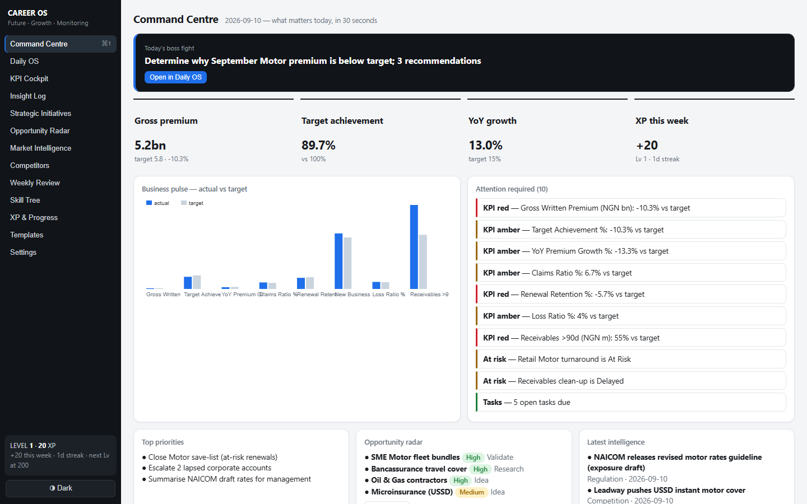
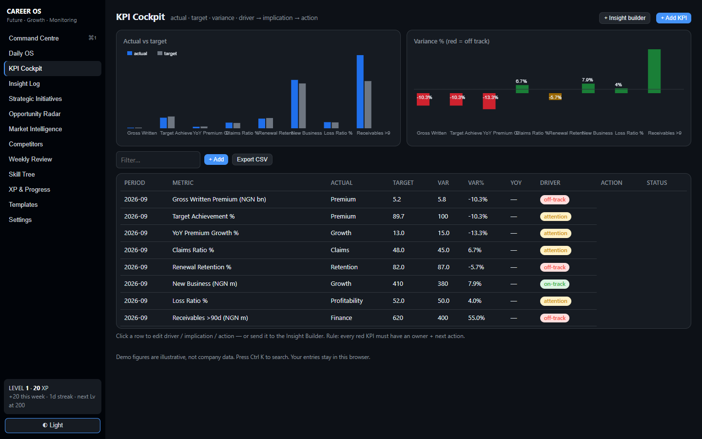

# Career OS — Future, Growth & Monitoring

A personal operating system for a Future, Growth & Monitoring Officer in insurance.
It answers four questions every day: how is the business performing, why is it
changing, where are the opportunities and risks, and what should I do next —
through one workflow: **Track → Analyse → Identify → Explain → Recommend → Act → Review.**




**Try it now (no install):** https://olu4wealth.github.io/career-os/

**Full user guide:** [USERGUIDE.md](USERGUIDE.md) — every section explained,
daily and weekly workflows, XP rules, backup, troubleshooting, FAQ.

## What it does

- **Command Centre** — boss fight, business pulse (actual vs target), and an
  attention engine that surfaces KPI deterioration, overdue initiatives, and open tasks.
- **Daily OS** — outcome-based planning, Pomodoro timer, and a distraction-free focus mode.
- **KPI Cockpit** — variance, variance %, and YoY auto-calculated, with driver →
  implication → action on every metric, plus an 8-step **Insight Builder** that
  writes management-ready insights to a permanent log.
- **Opportunity Radar** — staged pipeline with a value × feasibility matrix.
- **Market Intelligence + Competitor Monitoring** — signal → implication → action.
- **Strategic Initiatives, Weekly Review, Skill Tree, Templates,** and an
  output-based **XP system** (levels, streaks) that rewards results, not hours.

## Online vs local — read this first

There is one app with two places it can keep your data:

| | Online (the link above) | Local (app or Python) |
|---|---|---|
| Runs on | GitHub Pages, any device | Your PC only |
| Data stored in | Your browser (localStorage) | `career_os.db` (SQLite) |
| Sync between devices | No — each browser keeps its own copy | N/A |
| Back up via | Settings → Download full backup | Settings → Download full backup, or copy the `.db` file |

Both have identical screens and features. The online version exists because
GitHub Pages cannot run a database; the Python backend is a single
zero-dependency file (`server.py`, stdlib only).

## Run locally

**Easiest:** double-click `dist/CareerOS.exe` (or the *Career OS* desktop
shortcut). Your browser opens with the app — no Python, no commands.
Close its window to stop the app. To build the exe yourself:
`pip install pyinstaller`, then
`pyinstaller --onefile --noconsole --name CareerOS --add-data "docs;docs" server.py`.

**Or with Python:**

```
python server.py
```

then open http://127.0.0.1:8130. No dependencies, no build step.
To start over with fresh demo data: Settings → Reset demo data (or stop the
server, delete `career_os.db`, and restart).

## Verify it works

```
pip install playwright
python tests/test_browser.py
```

Runs 22 automated browser checks (Chrome) against both the local backend and
the offline demo mode. `python tests/test_live.py` checks the deployed site.

## Honest limits (v1)

- **Your data is only as safe as its storage.** Browser data can be wiped by
  clearing site data — download a backup regularly (Settings reminds you).
  There is no account, no sync, no multi-user support.
- **Sample figures are illustrative**, not real company data. Value appears
  when you enter your own numbers (CSV import per module, same columns as the
  original Excel workbook).
- **Not yet built:** AI assistant, native Excel import (CSV for now), live
  data-source integrations, competitor comparison dashboard.
- Charts are deliberately basic (zero-dependency canvas, no tooltips).

## License

MIT — see [LICENSE](LICENSE). Use it, fork it, share it.
